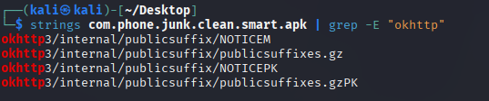
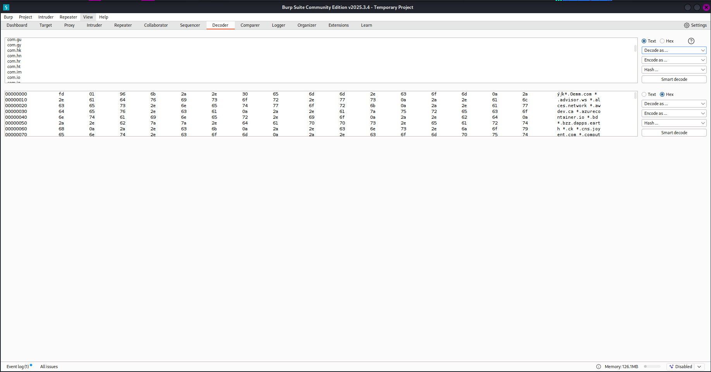
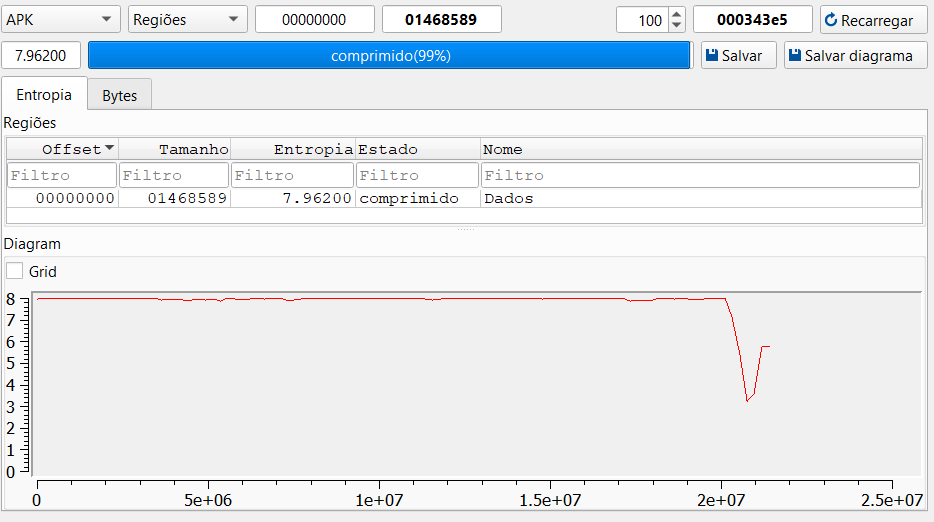
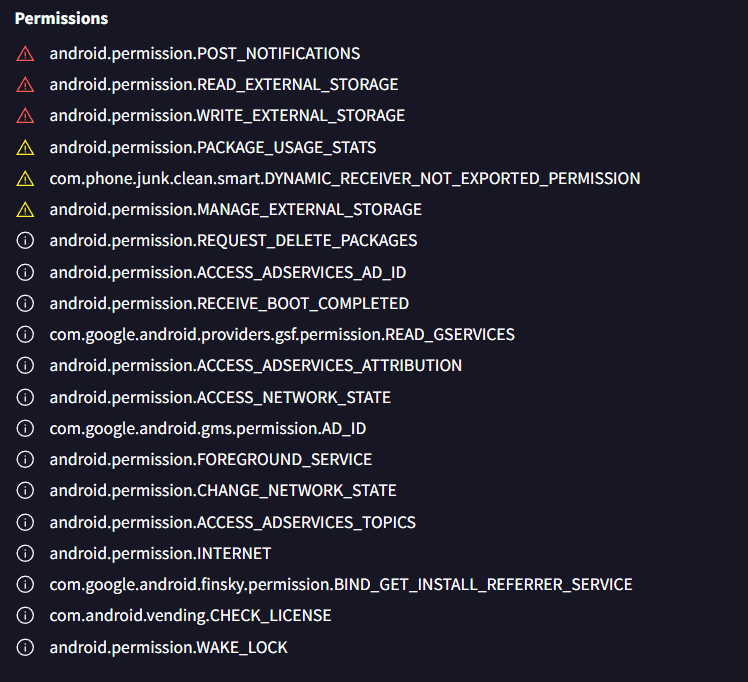
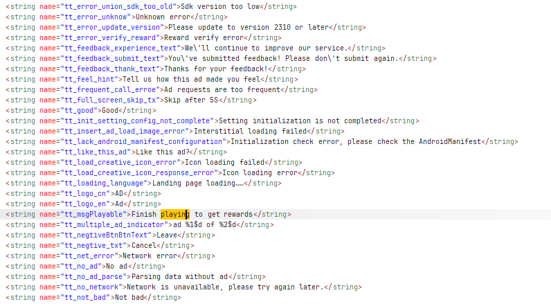
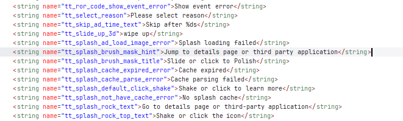

# ER_Android_Reversing_Assignment

1st_Assignment of ER

# Executive Summary

# User Perspective

# Organization Perspective

# Background

## Date

2026/02/27

## File Name (VirusTotal)

com.phone.junk.clean.smart.apk

# Static Analysis

## File Hashes (VirusTotal)

**MD4** - 6848658879f8c35d6c3252bef794daec

**MD5** - eb3b881048f49355a2d3a9493ab50eba

**SHA-1** - 7e40795e3884109ae87348ca700b4c04dc8751c8

**SHA-256** - 4e819b297c4f1a77a29ebf744df05ad9977e704c54fec73a65c219aa78dfb889

**SHA-512** - ca8013005bcb1f47c95a737d48eab7116ae45aa1c0d01e983b8b95d32df24795db6b929e916c8f04ec87fe076ca2ac58a3e75db451ea051b893631f495114c6a

**VHASH** - 4ce2832a29aaa75f13fc01a63c88b160

**SSDEEP** - 393216:rPLgXiODT06HXAi8C8IbE7iV6UhTLsoBB2Bhg7hJkjfs6ByYmZheN1D/R:DLODo6wNJEEOsUhPBYzgtJkjVByYmCnV

**TLSH** - T1F02733A7F328A42FD87330B18EBB421385995D4682436F63E915B21D1DB79C48F5AFC8

## File Size

21398921 bytes (20.41 MB)

## File Type

APK – Android Package Kit

# Signature

**Type:** X.509

**Version:** 3

**Serial number:** 0x754d71c472a3be7037e7b7bf143abe1628e05cdb

**Subject:** CN=Android, OU=Android, O=Google Inc., L=Mountain View, ST=California, C=US
**Valid from:** Wed Feb 25 08:51:21 WET 2026

**Valid until:** Fri Feb 25 08:51:21 WET 2056
**Public key type:** RSA

**Exponent:** 65537
**Modulus size (bits):** 4096

**Modulus:** 659496229831164718229890885341834523651689548564760088000918587208932886309124258807901473906081560808079623563840908412893654170209389235885857221055644284166947955841547810982059934562542839903660556116673453539820656605206735915284051911011522919938400070637969049037155196524419935385364020031607435501481678312493060220468529264498494227421375419785102658826013832398601105165232219884505099761734070270865537363043445947700683958665778925960219108221582841367645382927209718195365826888073035682371547015165905622216600075433822015880253734928176076133484947380602856912236746328044836816683511993150756351514502171483915498803697747692636380516363873489208117553883390921301382276275891730291801025780134484232506995107384049476033388887002384232489803531933411329902947898088391314147502168465140561034506689805592576030550610744015128768232926423191114538151545019374928221968627379840286336103556299815043318098503486788011760251416969288209802033576856439845439612845710912681948660136784638156447516972035349368633023550874110951942365743522019753101672049130034334115978530304896010201726572686714854256937088294259076369498838261388242957506477343544740895015867822044246243161066529065043827909919318139553748510084237

**Signature type:** SHA256withRSA

**Signature OID:** 1.2.840.113549.1.1.11

**MD5 Fingerprint:** 62 1E F6 F8 C9 BB 1D E4 EA 6E 71 7C 09 AD E4 00

**SHA-1 Fingerprint:** 3D 28 47 DB C4 28 2C CA B4 9C D6 F6 27 77 DE 0A 6A 92 72 72

**SHA-256 Fingerprint:** 54 27 C7 A8 11 CE 96 95 08 55 C0 0B 0C 5C 1E 2B 43 37 E1 C7 44 50 65 A8 7B FC E3 75 C8 82 A3 DC

**Packer/Compiler Info** – Java/Kotlin

**Version (VirusTotal)** – Internal Version: 1

**Displayed Version:** 1.0.8.1

**Minimum SDK Version:** 24

**Target SDK Version:** 36

**File Header Characteristics:** 50 4b 03 04 (PK)

**Language (DetectitEasy)** – Kotlin

# External Dependecies:

 **OKHttp3:**

 
 

 **Entropy:**
 

# AndroidManifest.xml

 One of the files that DetectitEasy was able to obtain was the AndroidManifest.xml. This is a file that is critical for the application, defining information like permissions, activities, intents and services. In our application, the following permissions were found:

 

 **Acceptable Permissions**

- android.permission.INTERNET
- android.permission.ACCESS_NETWORK_STATE
- android.permission.WAKE_LOCK
- android.permission.RECEIVE_BOOT_COMPLETED
- android.permission.REQUEST_DELETE_PACKAGES

 **Outside Communications**

- android.permission.ACCESS_ADSERVICES_AD_ID
- com.google.android.gms.permission.AD_ID
- android.permission.ACCESS_ADSERVICES_TOPICS
- android.permission.ACCESS_ADSERVICES_ATTRIBUTION
- com.google.android.finsky.permission.BIND_GET_INSTALL_REFERRER_SERVICE
- com.google.android.providers.gsf.permission.READ_GSERVICES

 **Controlling the Device**

- android.permission.MANAGE_EXTERNAL_STORAGE
- android.permission.PACKAGE_USAGE_STATS
- android.permission.BIND_JOB_SERVICE
- android.permission.BIND_NOTIFICATION_LISTENER_SERVICE
- android.permission.DUMP
- android.permission.POST_NOTIFICATIONS
- android.permission.READ_EXTERNAL_STORAGE
- android.permission.WRITE_EXTERNAL_STORAGE
  **OSINT**
- android.permission.ACCESS_NETWORK_STATE

The permissions shown here are mostly used on malware. There are a lot of permissions about managing the storage (ex: `MANAGE_EXTERNAL_STORAGE` allows the app to full access to external storage and files on behalf of the user.). Not only that but we also have `POST_NOTIFICATIONS` as this allows the app to post notifications. It’s even considered as dangerous by developer.android.com, `BIND_JOB_SERVICE` which is an Android permission for apps to perform any Background Tasks, `DUMP` allows the app to retrieve the state information from the whole system and `WRITE_EXTERNAL_STORAGE` allows the app to write to external storage. It’s also considered dangerous.
There’s also an extra information being read (OSINT-related), as the `ACCESS_NETWORK_STATE` is also present on the AndroidManifest file, and this gives access about all the networks of our device.


# Behavioral Analysis

**Setup**

In order to perform the dynamic analysis, the main apk file was first sent to the JADX for further investigation.

**Live Memory Dump**

- `ICommonParams`
  - First we noticed the creation of an interface (`ICommonParams`) that saves multiple information about the user into a Map structure, such as `DeviceID` or `UserID`. For each piece of data we did the full code flow.
  
```java
  package com.apm.insight;
  import java.util.List;
  import java.util.Map;

  /* JADX INFO: compiled from: r8-map-id-ce88e2bd4288c86909bdaac64d4c96611d145c55c02c55c7cc9024d475899202 */
  /* JADX INFO: loaded from: classes.dex */
  public interface ICommonParams {
    Map<String, Object> getCommonParams();

    String getDeviceId();

    List<String> getPatchInfo();

    Map<String, Integer> getPluginInfo();

    String getSessionId();

    long getUserId();
  } 
  ```

- `getDeviceId()` 
  - For every single data that is being archived, there's a few functions working with them. For this one there is `f11123b()` which is the interface where we can call this function. Then, `m5663d()` go and gets the value for future usage. Not only that but, function `m5664e()` also gets the value from the Map structure in a string format, which is then called in `m5695i()` to be written in a JSONObject.

```java
  /* JADX INFO: renamed from: d */
public final String m5663d() {
    try {
        return this.f11123b.getDeviceId();
    } catch (Throwable unused) {
        return "";
    }
}

/* JADX INFO: renamed from: e */
public final String m5664e() {
    try {
        return String.valueOf(this.f11123b.getCommonParams().get("aid"));
    } catch (Throwable unused) {
        return "4444";
    }
}

/* JADX INFO: renamed from: i */
private static JSONObject m5695i() {
    return C2909d.m5778b(C2837e.m5168a().m5664e());
}
```


- `getPatchInfo()`
  - For PatchInfo, we also have an interface (`f11180c`) which gets the value and then verified and written into a List by `m5244a()`. At last this value will get written into our final JSONObject (`m5230a()`).

 ```java
 try {
    c2842a.m5244a(this.f11180c.getPatchInfo());
} catch (Throwable th) {
    try {
        c2842a.m5244a(Arrays.asList("Data fetch failed since source misstake:\n" + C2884m.m5563a(th)));
    } catch (Throwable unused) {
    }
}

/* JADX INFO: renamed from: a */
private C2842a m5230a(String str, JSONArray jSONArray) {
    JSONObject jSONObjectOptJSONObject = this.f10895a.optJSONObject("custom_long");
    if (jSONObjectOptJSONObject == null) {
        jSONObjectOptJSONObject = new JSONObject();
        m5247a("custom_long", jSONObjectOptJSONObject);
    }
    try {
        jSONObjectOptJSONObject.put(str, jSONArray);
    } catch (JSONException unused) {
    }
    return this;
}
```
- `getPluginInfo()`
  - For PluginInfo, we have the same interface as PatchInfo (`f11180c`), and the function (`m5245()`) will deal with writing the value, which is a Map Structure, and then write it to the JSONObject.

 ```java
 /* JADX INFO: renamed from: b */
private C2842a m5749b(C2842a c2842a) {
    c2842a.m5239a(C2837e.m5196q(), C2837e.m5197r());
    if (C2837e.m5193n()) {
        c2842a.m5247a("is_mp", (Object) 1);
    }
    try {
        c2842a.m5245a(this.f11180c.getPluginInfo());
    } catch (Throwable th) {
        try {
            HashMap map = new HashMap();
            map.put("Data fetch failed since source misstake:\n" + C2884m.m5563a(th), 0);
            c2842a.m5245a(map);
        } catch (Throwable unused) {
        }
    }
    c2842a.m5250b(C2837e.m5195p());
    c2842a.m5247a("process_name", C2872a.m5445d(C2837e.m5186g()));
    return c2842a;
}

/* JADX INFO: renamed from: a */
public final C2842a m5245a(Map<String, Integer> map) {
    JSONArray jSONArray = new JSONArray();
    if (map == null) {
        this.f10895a.put("plugin_info", jSONArray);
        return this;
    }
    for (String str : map.keySet()) {
        JSONObject jSONObject = new JSONObject();
        jSONObject.put(CampaignEx.JSON_KEY_PACKAGE_NAME, str);
        jSONObject.put("version_code", map.get(str));
        jSONArray.put(jSONObject);
    }
    this.f10895a.put("plugin_info", jSONArray);
    return this;
}
```

- `getSessionId()`
  - This simple function get the value of the SessionId, and stores it into a parcel. A parcel is where this value will get parsed for future use.

```java
  public int getSessionId() {
    return this.zaa;
}

@Override // android.os.Parcelable
public void writeToParcel(Parcel parcel, int i3) {
    int iBeginObjectHeader = SafeParcelWriter.beginObjectHeader(parcel);
    SafeParcelWriter.writeInt(parcel, 1, getSessionId());
    SafeParcelWriter.writeBoolean(parcel, 2, this.zab);
    SafeParcelWriter.finishObjectHeader(parcel, iBeginObjectHeader);
}
```


- `getUserId()`
  - Finally, about UserId. The interface it uses is `f11123b`, and the `m5665f()` function gets the value from this same interface. Then the `m5227e()` function writes the value to the JSONObject. We also have the variable that saves the UserId value -> `jM5665f`.


```java
/* JADX INFO: renamed from: f */
public final long m5665f() {
    try {
        // Retrieves User ID from the ICommonParams instance
        return this.f11123b.getUserId();
    } catch (Throwable unused) {
        // Returns 0L (Long) as a safe fallback if retrieval fails
        return 0L;
    }
}

/* JADX INFO: renamed from: e */
public final JSONObject m5227e() {
    try {
        // Calls the fetcher method
        long jM5665f = C2837e.m5168a().m5665f();
        
        // Only adds to JSON if the ID is valid (greater than 0)
        if (jM5665f > 0) {
            this.f10894c.put("user_id", jM5665f);
        }
    } catch (JSONException e10) {
        e10.printStackTrace();
    }
    return this.f10894c;
}
```

- `C2869i()`
  - The reason why this function is interesting is because it establishes internet connection. As a normal cleaner app, you don't need internet connection and that's why this is suspicious.

```java
/**
 * Establishes a connection to the server and prepares the output stream.
 * * @param str  The destination URL
 * @param str2 The boundary string for multipart data
 * @param z10  Boolean flag to enable Gzip compression
 */
public C2869i(String str, String str2, boolean z10) throws ProtocolException {
    this.f11054c = str2;
    this.f11055d = z10;
    
    // Create a unique boundary for the multipart form data
    String boundary = "AAA" + System.currentTimeMillis() + "AAA";
    this.f11052a = boundary;

    try {
        // Initialize the connection
        HttpURLConnection httpURLConnection = (HttpURLConnection) new URL(str).openConnection();
        this.f11053b = httpURLConnection;
        
        // Configure basic connection settings
        httpURLConnection.setUseCaches(false);
        httpURLConnection.setDoOutput(true); // Allows sending data
        httpURLConnection.setDoInput(true);  // Allows receiving response
        httpURLConnection.setRequestMethod("POST");

        // Inject custom headers from the MonitorCrash/APM component
        CustomRequestHeader customRequestHeader = MonitorCrash.mCustomRequestHeader;
        if (customRequestHeader != null) {
            customRequestHeader.addRequestHeader(this.f11053b);
        }

        // Set the Content-Type header for multipart data
        this.f11053b.setRequestProperty("Content-Type", "multipart/form-data; boundary=" + boundary);
        // Handle Gzip compression if enabled
        if (!z10) {
            // Standard stream if Gzip is disabled
            this.f11056e = new C2866f(this.f11053b.getOutputStream());
        } else {
            // Compressed stream to hide data size/usage
            this.f11053b.setRequestProperty("Content-Encoding", "gzip");
            this.f11057f = new C2871k(this.f11053b.getOutputStream());
        }
        
    } catch (Exception e) {
        throw new ProtocolException("Connection initialization failed");
    }
}

```

Not only that but there's also a link generator functions (`generateLink()`) that uses a harcoded link inside (`AFj1vSDK`) to decide to which server it sends the info to.
As you can see in `AFj1vSDK` the link has formatted strings with %s, meaning that the app can fill the link with whatever data it wants, such as userId or even SessionId.


`generateLink`
```java
public String generateLink() {
    StringBuilder sb = new StringBuilder();
    String str = this.values;
    
    // 1. Logic to determine the Base URL (using the AppsFlyer template)
    sb.append((str == null || !str.startsWith("http")) ? 
        String.format(AFj1vSDK.valueOf, AppsFlyerLib.getInstance().getHostPrefix(), AFb1tSDK.valueOf().getHostName()) 
        : this.values);
    
    // 2. Append the specific endpoint or event name
    if (this.AFInAppEventParameterName != null) {
        sb.append('/');
        sb.append(this.AFInAppEventParameterName);
    }
    
    // 3. Map out the keystore/parameters (Device ID, User ID, etc.)
    Map<String, String> mapAFKeystoreWrapper = AFKeystoreWrapper();
    StringBuilder sb2 = new StringBuilder();
    
    // 4. Loop through the map to create the query string (?key=value&key2=value2)
    for (Map.Entry<String, String> entry : mapAFKeystoreWrapper.entrySet()) {
        // Adds '?' for the first parameter and '&' (Typography.amp) for others
        sb2.append(sb2.length() == 0 ? '?' : Typography.amp);
        sb2.append(entry.getKey());
        sb2.append('=');
        sb2.append(entry.getValue());
    }
    
    // 5. Combine the base URL with the parameters
    sb.append(sb2.toString());
    
    return sb.toString();
}
```

`AFj1vSDK`
```java
package com.appsflyer.internal;

import androidx.annotation.VisibleForTesting;

/* JADX INFO: loaded from: classes3.dex */
public final class AFj1vSDK {
    
    @VisibleForTesting(otherwise = 3)
    public static String valueOf = "https://%sapp.%s";
}
```

Now, one of the most alarming segments of this apk is an specific `DeviceData`. As we can see, it takes data from our device such as the model, totalRam, diskSpace, modelClass, etc... All of this data is written to `Build.PRODUCT`.

```java
public final String toString() {
    // 1. Initialize StringBuilder with the architecture tag
    StringBuilder sb = new StringBuilder("DeviceData{arch=");
    sb.append(this.f26024a);
    sb.append(", model=");
    sb.append(Build.MODEL);
    sb.append(", availableProcessors=");
    sb.append(this.f26025b);
    sb.append(", totalRam=");
    sb.append(this.f26026c);
    sb.append(", diskSpace=");
    sb.append(this.f26027d);
    sb.append(", isEmulator=");
    sb.append(this.f26028e);
    sb.append(", state=");
    sb.append(this.f26029f);
    sb.append(", manufacturer=");
    sb.append(Build.MANUFACTURER);
    sb.append(", modelClass=");
    return X0.b.o(sb, Build.PRODUCT, "}");
}
```

The most alarming is `isEmulator=`. Why does an app needs to know if we are running it in an emulator environment?

**Strings.xml**

Inside strings.xml file, there's every single string the user will be able to see while using the app. As this app goes by a cleaner app, but also an agressive spyware/adware, there's a lot of ad's mention such as:




Not only that, but also it confirms the permission to uninstall apps:


And also the mention of "Fraud" or related words:


# References 

- [https://www.w3schools.com/java/java_map.asp](https://www.w3schools.com/java/java_map.asp)
- [https://developer.android.com/reference/packages](https://developer.android.com/reference/packages)
- [https://www.virustotal.com/gui/file/4e819b297c4f1a77a29ebf744df05ad9977e704c54fec73a65c219aa78dfb889/detection](https://www.virustotal.com/gui/file/4e819b297c4f1a77a29ebf744df05ad9977e704c54fec73a65c219aa78dfb889/detection)


